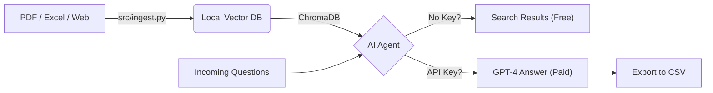

# AI Vendor Response Agent


**An automated RAG (Retrieval-Augmented Generation) agent designed to streamline Third-Party Risk Management (TPRM).**

This tool ingests your company's "Source of Truth" security artifacts and uses a local Vector Database to autonomously answer incoming security questionnaires.

### Hybrid AI Engine
* **Free / Local Mode:** If no API key is provided, the agent runs **100% offline** using local HuggingFace embeddings (CPU) to search and retrieve relevant evidence.
* **Enterprise Mode:** If an OpenAI API key is detected, it automatically upgrades to **GPT-4** to generate full, context-aware answers with confidence scoring.

## Key Features

* **Omni-Channel Ingestion:** Automatically ingests and indexes **PDFs**, **Excel** (previous questionnaires), **Word Docs**, and **Website URLs**.
* **Audit-Ready Citations:** Every answer includes a reference to the specific source document and page number used to generate the response.
* **Bulk CSV Processing:** Capable of ingesting a CSV with hundreds of questions and generating a filled response file in minutes.
* **Confidence Flagging:** Automatically flags low-confidence answers or missing data as "Review Required" so you don't accidentally mislead an assessor.
* **Local Vector Store:** Uses `ChromaDB` locally—your sensitive embeddings are not stored in a third-party cloud vector provider.

## Architecture



## Usage

### 1. Setup

Clone the repository and install dependencies:

```bash
git clone [https://github.com/codyjkeller/ai-vendor-response-agent.git](https://github.com/codyjkeller/ai-vendor-response-agent.git)
cd ai-vendor-response-agent
pip install -r requirements.txt
```

### 2. Configure Environment (Optional)

* **For Search-Only (Free):** You can skip this step.
* **For AI Answers (Paid):** Create a `.env` file in the root directory:

```bash
OPENAI_API_KEY=sk-your-key-here
LLM_MODEL=gpt-4o  # Optional: default is gpt-4
```

### 3. Build the Knowledge Base

Place your security artifacts into the `data/` folder. The tool supports:
* **PDFs:** Policies, SOC 2 Reports.
* **Excel:** Previous questionnaires (it reads all text).
* **Word:** Policy documents (`.docx`).
* **Web:** Create a `data/urls.txt` file and paste links (one per line) to scrape.

Run the ingestion script to build the brain:

```bash
python src/ingest.py
```

### 4. Run the Agent

**Option A: Bulk Processing (Recommended)**
Feed the agent a CSV file containing a list of questions (must have a column named `Question`).

```bash
python src/agent.py --file questions.csv
```

**Option B: Interactive Mode**
Chat with your security policies in the terminal.

```bash
python src/agent.py --interactive
```

## Output Format

The tool generates a file named `completed_responses.csv` containing:

| Question | AI Response | Status | Evidence |
| :--- | :--- | :--- | :--- |
| **Do you use MFA?** | Yes, we enforce MFA for all employees via Okta. | Auto-Filled | Access_Policy.pdf (Pg. 4) |
| **Do you have ISO 27001?** | I could not find mention of ISO 27001 in the provided documents. | Review | No Source Found |

## Data Privacy Note

Do not commit the `data/` folder, `.env` file, or `chroma_db/` directory to GitHub. A `.gitignore` is included to prevent this.

*While the Vector DB is local, if using the OpenAI mode, text chunks are sent to OpenAI for generation. Ensure this aligns with your company's AI usage policy.*

## License

MIT
