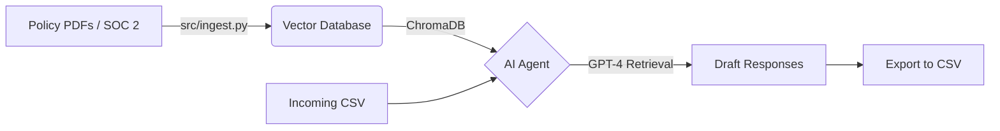

# 🤖 AI Vendor Response Agent


**An automated RAG (Retrieval-Augmented Generation) agent designed to streamline Third-Party Risk Management (TPRM).**

This tool ingests your company's "Source of Truth" security artifacts (SOC 2 reports, Policy PDFs, previous SIG questionnaires) and uses a local Vector Database to autonomously answer incoming security questionnaires. 

Unlike generic chatbots, this agent provides **Source Citations** (e.g., "See Page 4 of Access Policy") and **Confidence Scoring** to ensure audit-readiness.

## ✨ Key Features

* **📄 Audit-Ready Citations:** Every answer includes a reference to the specific source document and page number used to generate the response.
* **🚀 Bulk CSV Processing:** Capable of ingesting a CSV with hundreds of questions and generating a filled response file in minutes.
* **⚠️ Confidence Flagging:** Automatically flags low-confidence answers or missing data as "Review Required" so you don't accidentally mislead an assessor.
* **🔒 Local Vector Store:** Uses `ChromaDB` locally—your sensitive embeddings are not stored in a third-party cloud vector provider.

## 🏗️ Architecture



## 🚀 Usage

### 1. Setup

Clone the repository and install dependencies:

```bash
git clone [https://github.com/codyjkeller/ai-vendor-response-agent.git](https://github.com/codyjkeller/ai-vendor-response-agent.git)
cd ai-vendor-response-agent
pip install -r requirements.txt
```

### 2. Configure Environment

Create a `.env` file in the root directory to store your OpenAI API key:

```bash
OPENAI_API_KEY=sk-your-key-here
```

### 3. Build the Knowledge Base

Place your security documents (PDFs, Text files) into the `data/` folder and run the ingestion script. This creates the local Vector Database.

```bash
# Reads all files in /data and builds the brain
python src/ingest.py
```

### 4. Run the Agent

**Option A: Bulk Processing (Recommended)**
Feed the agent a CSV file containing a list of questions (must have a column named `Question`).

```bash
python src/agent.py --file questions.csv
```

**Option B: Interactive Mode**
Chat with your security policies in the terminal.

```bash
python src/agent.py --interactive
```

## 📂 Output Format

The tool generates a file named `completed_questions.csv` containing:

| Question | AI Response | Status | Evidence |
| :--- | :--- | :--- | :--- |
| **Do you use MFA?** | Yes, we enforce MFA for all employees via Okta. | ✅ Auto-Filled | Access_Policy.pdf (Pg. 4) |
| **Do you have ISO 27001?** | I could not find mention of ISO 27001 in the provided documents. | ⚠️ Review | No Source Found |

## 🛡️ Data Privacy Note

Do not commit the `data/` folder, `.env` file, or `chroma_db/` directory to GitHub. A `.gitignore` is included to prevent this.

*While the Vector DB is local, the text chunks are sent to OpenAI for embedding and generation. Ensure this aligns with your company's AI usage policy.*

## 📜 License

MIT
